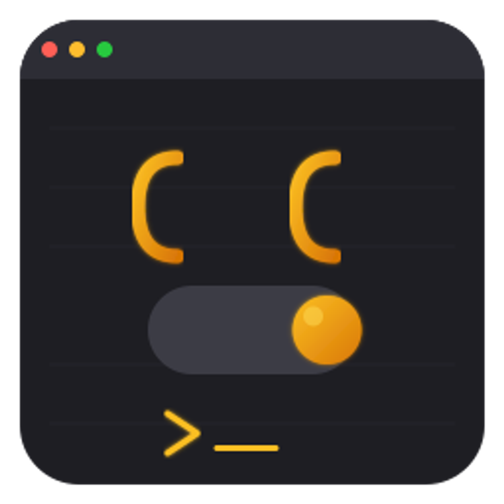

# Claude Skills Manager

<p align="center">
  
</p>

<p align="center">
  <a href="https://github.com/BruceY-rgb/ClaudeDeck/releases/latest">
    
  </a>
  <a href="https://github.com/BruceY-rgb/ClaudeDeck/releases/latest">
    
  </a>
  <a href="https://github.com/BruceY-rgb/ClaudeDeck/blob/master/LICENSE">
    
  </a>
</p>

> English | [中文](./README-zh.md)

A visual desktop application for managing Claude Code agents, skills, plugins, and slash commands. Built with Electron + React + TypeScript.

## Features

### 🎯 Agent Management
- View all Claude Code agents in a visual interface
- Configure agent settings and parameters
- Monitor agent status and activity

### 🛠️ Skills Management
- Browse installed skills from the marketplace
- Enable/disable skills with one click
- View skill details and documentation
- Create and edit custom skills

### 🔌 Plugins Management
- View all installed plugins
- Configure plugin settings
- Enable/disable plugins

### ⚡ Slash Commands
- Browse available slash commands
- View command descriptions and usage
- Quick access to command documentation

### 📁 File Management
- Monitor watched directories
- Configure file system watching options
- View file change history

### 🖥️ System Integration
- Native system tray support
- System notifications
- Global shortcuts
- Dark/Light theme support

## Downloads

### Latest Release
- **macOS**: [Claude Skills Manager-1.0.0-mac.dmg](https://github.com/BruceY-rgb/ClaudeDeck/releases/latest)
- **Windows**: [Claude Skills Manager Setup 1.0.0.exe](https://github.com/BruceY-rgb/ClaudeDeck/releases/latest)

## Development

### Prerequisites
- Node.js 20+
- npm 10+
- Electron 40+

### Setup

```bash
# Clone the repository
git clone https://github.com/BruceY-rgb/ClaudeDeck/claude-skills-and-agents-manager.git
cd claude-skills-and-agents-manager

# Install dependencies
npm install

# Start development server
npm run dev
```

### Build

```bash
# Build for current platform
npm run dist

# Build for macOS
npm run dist:mac

# Build for Windows
npm run dist:win
```

### Project Structure

```
claude-skills-and-agents-manager/
├── src/
│   ├── main/           # Electron main process
│   ├── preload/        # Preload scripts
│   └── renderer/       # React frontend
├── resources/          # App resources (icons, etc.)
├── release/           # Built installers
├── electron.vite.config.ts
├── package.json
└── README.md
```

## Tech Stack

- **Framework**: Electron 40+
- **Frontend**: React 19 + TypeScript
- **Styling**: Tailwind CSS 4
- **State Management**: Zustand
- **Build Tool**: electron-vite + electron-builder

## License

MIT License - see [LICENSE](LICENSE) for details.

## Contributing

Contributions are welcome! Please feel free to submit a Pull Request.

---

<p align="center">Built with ❤️ using Electron</p>
