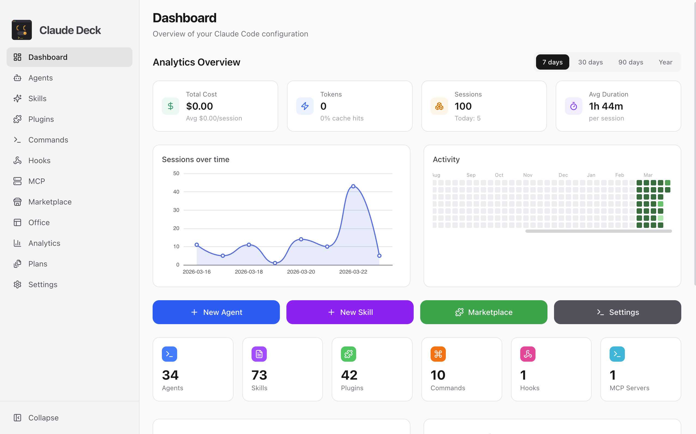
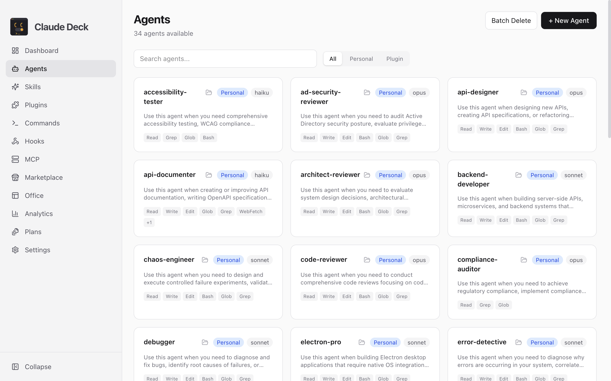
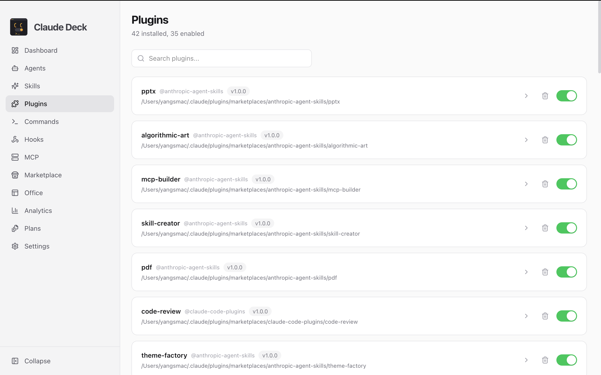
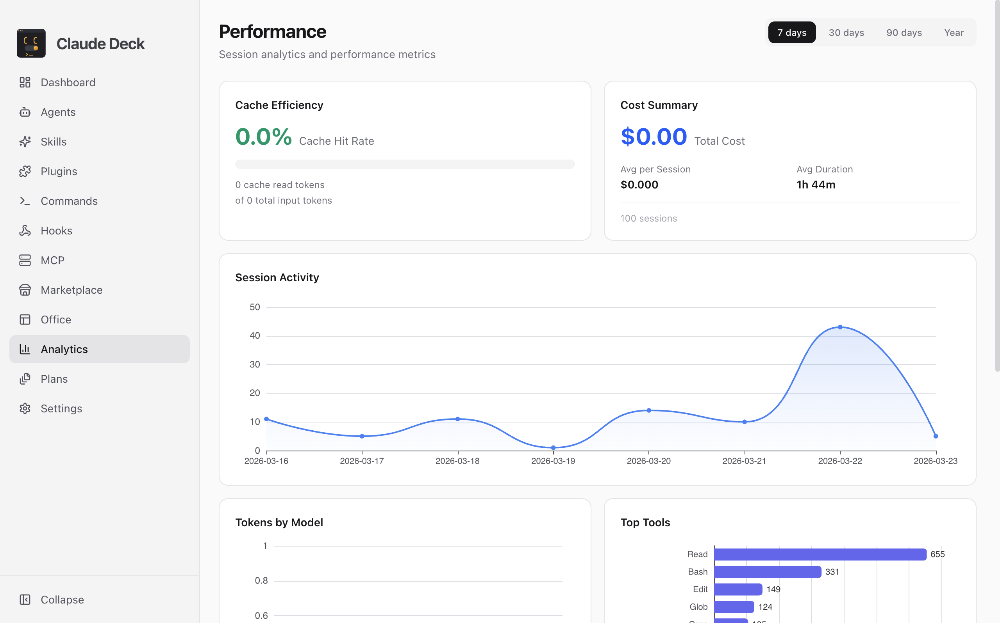
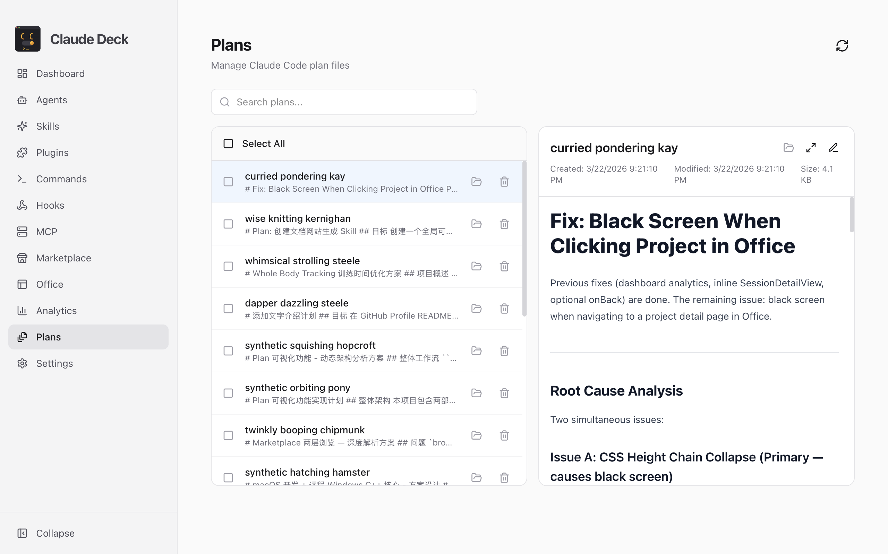

# Claude Skills Manager

<p align="center">
  
</p>

<p align="center">
  <strong>Take Full Control of Your Claude Code Setup</strong>
</p>

<p align="center">
  A beautiful desktop application to manage agents, skills, plugins, and slash commands for Claude Code - all in one place.
</p>

<p align="center">
  <a href="https://github.com/BruceY-rgb/ClaudeDeck/releases/tag/v2.0.0">
    
  </a>
  <a href="https://github.com/BruceY-rgb/ClaudeDeck/releases/tag/v2.0.0">
    
  </a>
  <a href="https://github.com/BruceY-rgb/ClaudeDeck">
    
  </a>
  <a href="https://github.com/BruceY-rgb/ClaudeDeck/blob/master/LICENSE">
    
  </a>
  <a href="#">
    
  </a>
</p>

> English | [中文](./README-zh.md)

---

## Features

### Agent Management
- View all Claude Code agents in a beautiful visual interface
- Configure agent settings and parameters with ease
- Monitor agent status and activity in real-time

### Skills Management
- Browse and discover skills from the marketplace
- Install or disable skills with a single click
- View detailed documentation for each skill
- Create your own custom skills

### Plugins Management
- See all installed plugins at a glance
- Configure plugin settings without leaving the app
- Enable/disable plugins instantly

### Slash Commands
- Explore all available slash commands
- Read descriptions and usage examples
- Quick access to command documentation

### File Monitoring
- Watch directories for changes
- Configure file system watching options
- Track file change history

### System Integration
- System tray support with quick actions
- Native notifications
- Global keyboard shortcuts
- Dark & Light theme support

---

## Screenshots








---

## Quick Start

### Download & Install

**Latest Release (v2.0.0)**

| Platform | Download |
|----------|----------|
| macOS | [Claude Skills Manager-2.0.0-mac.dmg](https://github.com/BruceY-rgb/ClaudeDeck/releases/tag/v2.0.0) |
| Windows | [Claude Skills Manager Setup 2.0.0.exe](https://github.com/BruceY-rgb/ClaudeDeck/releases/tag/v2.0.0) |

> **Note:** After downloading, macOS users may need to right-click and select "Open" to bypass Gatekeeper.

---

## Development

### Prerequisites

- Node.js 20+
- npm 10+

### Setup

```bash
# Clone the repository
git clone https://github.com/BruceY-rgb/ClaudeDeck.git
cd ClaudeDeck

# Install dependencies
npm install

# Start development server
npm run dev
```

### Build

```bash
# Build for current platform
npm run dist

# Build for macOS
npm run dist:mac

# Build for Windows
npm run dist:win
```

---

## Project Structure

```
claude-skills-and-agents-manager/
├── src/
│   ├── main/           # Electron main process
│   ├── preload/        # Preload scripts
│   └── renderer/       # React frontend
├── resources/          # App resources (icons, etc.)
├── release/           # Built installers
├── electron.vite.config.ts
├── package.json
└── README.md
```

---

## Tech Stack

- **Framework:** Electron 40+
- **Frontend:** React 19 + TypeScript
- **Styling:** Tailwind CSS 4
- **State Management:** Zustand
- **Build Tool:** electron-vite + electron-builder

---

## License

MIT License - see [LICENSE](LICENSE) for details.

---

<p align="center">
  Built with Electron + React + TypeScript
</p>
